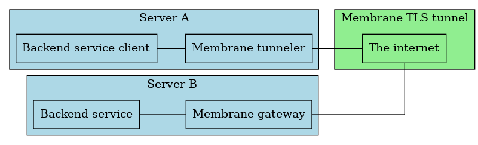

# Membrane
A TLS proxy for exposing backend services to the internet safely.

## Architecture


_(I have no idea how to make this image better lol)_

The gateway is a server that exposes an insecure service over TLS, and a tunneler is a client to a gateway that exposes the service in plaintext on localhost.

## Setup
### On the same server as the backend service
Generate the keys you need for the server using the provided `gen_keys.py`, or a set of TLS certificates you already have.
To generate a CA, intermediate and end keys, run `./gen_certs.py ca` and answer the questions. For the server name either use the IP or hostname that will be used to connect to the server running the tunnel end. For example; if your server is exposed on `1.2.3.4`, use `1.2.3.4` for the server name, or if it is exposed on `example.org`, use `example.org`. The script requires that you have openssl installed and available on `PATH`. It will create a new directory called keys containing the following files:
```
ca.[cert|key|rsa]
end.[cert|chain|fullchain|key|req|rsa]
inter.[cert,key,req,rsa]
openssl.cnf
```

In order for clients to connect you will also need to generate a client key, and this can be done with `./gen_certs.py client`, which will generate the following files:
```
client.[cert|chain|fullchain|key|req|rsa]
```

You should then create a `config.toml` file with the following content:
```toml
mode = "gateway"

[config]
server_certificates_file = "keys/rsa/end.fullchain"
client_certificates_file = "keys/rsa/client.chain"
key_file = "test-keys/rsa/end.rsa"
# Replace with the port number you will expose to the internet
listen_port = 20443
# Replace with the hostname or IP of the server running the service you want to expose
target_host = "localhost"
# Replace with the port number of the service you want to expose.
target_port = 20000
```

Finally, you can launch the server with `./membrane` in the same directory as the `keys` directory and the `config.toml`.

### On the server you want to connect to the service from
First you will need the following files that were generated on the other server:
```
end.chain
client.fullchain
client.rsa
```
Place these in the `keys` directory.

Next you will need to create a `config.toml` like the following:
```toml
mode = "tunneler"

[config]
server_certificates_file = "keys/end.chain"
client_certificates_file = "keys/client.fullchain"
key_file = "keys/client.rsa"
# Replace this with the port the service should be exposed on localhost
listen_port = 20001
# Replace this with the IP or hostname of the backend service
target_host = "localhost"
# Replace this with the port of the backend service
target_port = 20443
```

You can then point whatever client you need at `localhost:20001` (or whatever `listen_port` you set) and membrane will open a secure tunnel to the gateway for you.
